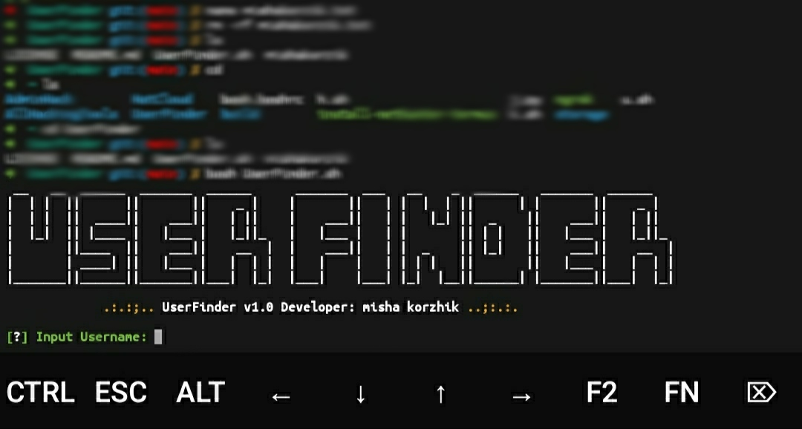

<p align="center">
<a href="mailto:developer.mishakorzhik@gmail.com"></a>
<a href="https://github.com/mishakorzik/UserFinder"></a>
<a href="https://github.com/mishakorzik/UserFinder/blob/main/LICENSE"></a>
<a href=""></a>
<a href="https://github.com/mishakorzik"></a>
<a href="https://github.com/mishakorzik"></a>

</p>

<p align="center">
• <a href="https://github.com/mishakorzik/UserFinder/blob/main/LICENSE">License</a> 
• <a href="https://github.com/mishakorzik/UserFinder/issues">Issues</a> 
• <a href="https://github.com/mishakorzik">Developer</a> 
• <a href="https://github.com/mishakorzik/UserFinder/wiki">Wikipedia</a> •


**Find user in social and more informations!**

> Я не несу ответственности за ваши действия. Скачивая программное обеспечение из этого репозитория, вы соглашаетесь с [лицензией](https://github.com/mishakorzik/UserFinder/blob/main/LICENSE).


### How to Install

```
apt update
apt upgrade
apt install git
git clone https://github.com/mishakorzik/UserFinder
```

### How to Start
```
cd UserFinder
bash UserFinder.sh
```

## Find Me 
[](https://t.me/ubp2q)
[](https://github.com/mishakorzik)
[](https://twitter.com/MishaKorzhik)
[](https://discord.gg/xwpMuMYW57)
  
### Screenshot
#### here is a `screenshot` of the UserFinder tool. As you can see, everything works well for me, without `glitches` and `lags`.

**Repository Views** 

 
  
**If you want to donate, click on the button**
<a href="https://www.buymeacoffee.com/misakorzik"></a>

## I recommend watching

1.<a href="https://github.com/mishakorzik/qiq">qiq - Useful batch installer</a> <br>
2.<a href="https://github.com/mishakorzik/Gmail-Hack">Gmail-Hack - Easy email hacking</a> <br>
3.<a href="https://github.com/mishakorzik/AdminHack">AdminHack - Hacking bad sites</a> <br>
4.<a href="https://github.com/mishakorzik/Infect">Infect - Easy virus creation</a> <br>
5.<a href="https://github.com/mishakorzik/Free-Proxy">Free-Proxy - Lots of free proxy servers</a> <br>
6.<a href="https://github.com/mishakorzik/IpHack">IpHack - Easy Tracking smartphones</a> <br>
7.<a href="https://github.com/mishakorzik/Ultra-DDos">Ultra-DDos - Hing ddos bad sites</a> <br>
  
## Supporters
[](https://github.com/mishakorzik/UserFinder/stargazers)
[](https://github.com/mishakorzik/UserFinder/members)
